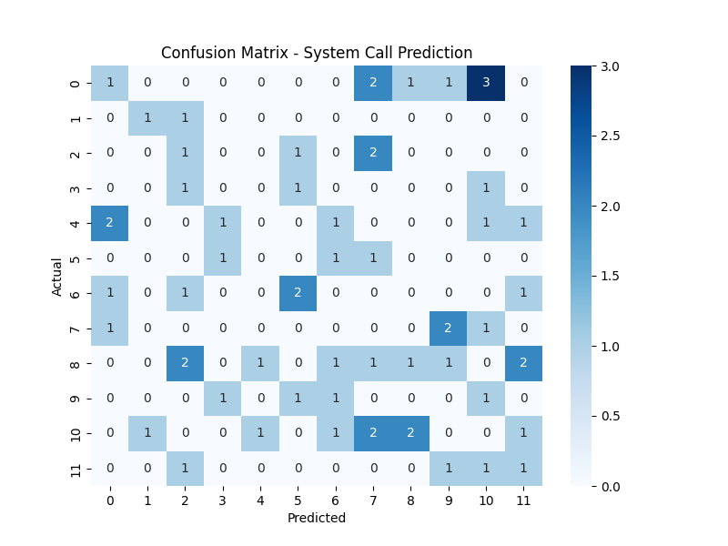

# 🧠 AI-Enhanced System Call Optimization

### 📘 Course: CSE316 — Operating Systems  
### 🏫 Lovely Professional University  
### 👨‍💻 Group Members
- **Ayush Tripathi**  
- **Srayansh Singh Verma**
- **Ayush Ranjan**

---

## 📄 Project Overview
The **AI-Enhanced System Call Optimization** project uses Artificial Intelligence to improve how system calls are handled in an Operating System.  
System calls are the bridge between user programs and the kernel, but frequent calls can lead to latency due to context switching and scheduling delays.

Our goal is to create an **AI-driven optimization system** that:
- Learns patterns from historical system call data,  
- Predicts and prioritizes upcoming calls, and  
- Reorders them to reduce overall execution latency.

This improves both **CPU utilization** and **system responsiveness.**

---

## 🧩 Module-Wise Breakdown

### **Module 1 — Data Acquisition & Monitoring**
- Collects system call logs (PID, SysCall ID, execution time, timestamp).  
- Stores them in CSV format for later AI analysis.  
- Can simulate data using Python or C (`scheduler_simulator.c`).

### **Module 2 — AI Optimization Engine**
- Uses a **Random Forest** model to detect frequent call patterns.  
- Predicts likely next system calls and optimizes scheduling order.  
- Optionally supports reinforcement learning for adaptive tuning.

### **Module 3 — Visualization & Analysis Dashboard**
- Provides a **Streamlit** dashboard to visualize:  
  - System call frequencies  
  - Execution-time distributions  
  - Before/after optimization metrics  
- Demonstrates measurable latency improvement.

---

## ⚙️ Functionalities
✅ Generate or capture system call data  
✅ Preprocess and normalize the data  
✅ Train an AI model for call prediction  
✅ Optimize scheduling order dynamically  
✅ Visualize performance improvements in real time

---

## 🧠 Technology Stack

| Component | Tools / Libraries |
|------------|------------------|
| **Languages** | Python (ML + dashboard), C (simulation) |
| **AI / ML** | Scikit-learn · NumPy · Pandas |
| **Visualization** | Plotly · Matplotlib · Streamlit |
| **Version Control** | GitHub |
| **IDE / Tools** | VS Code · PyCharm |

---

## 🚀 Execution Plan

1. **Data Collection**  
   Run `data_collector.py` to generate sample system-call logs.

2. **Preprocessing**  
   Execute `preprocessor.py` to clean and encode the data.

3. **Model Training**  
   Use `optimizer.py` (or `main.py`) to train and evaluate the AI model.

4. **Visualization**  
   Launch the dashboard:  
   ```bash
   streamlit run dashboard/dashboard_app.py

---

## 👥 Contributors

| Name | Contribution |
|------|--------------|
| Ayush Ranjan | Real-Time Monitoring system with psutil + UI Enhancements |
| Srayansh Singh Verma | End-to-end ML pipeline, UI integration |
| Ayush Tripathi | ML Evaluation: Confusion Matrix + Classification Report |

### 📌 Model Performance Visualization

